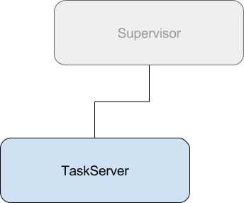
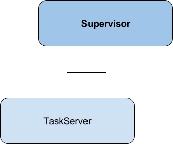

footer:  @davejlong PGP (4FF9ED7C)
build-lists: true
theme: Poster, 1

[.footer]:


^ We've talked about Robot's putting us in a people zoo.
^ Now, how about getting eaten by zombies?

---


## [fit] Building telephony 
## [fit] applications with
## [fit] Twilio and Elixir

---


## Dave Long

### Director of Development @ Cage Data

Husband & Father
Missionary to Uganda
[@davejlong](https://twitter.com/davejlong) on Twitter / GitHub / Keybase
[davejlong.com](https://ghost.davejlong.com) on Web

^ Director of Dev and Client services
^ Live in the forest between Boston and New York

---


### Subscribe to the application at
## [zombies.davejlong.com]()

^ It makes the end result of this talk way more impressive.

---


## [fit] Fending Off Zombies

1. What is Elixir?
2. What is OTP?
3. What is Twilio?
4. Let's build something!

^ We'll spend the first half of the talk going over some of the details of what Elixir and OTP is, where they come from and what the really powerful features of Elixir can give you. We'll also look at what Twilio is really quickly for those that don't know.

---
[.autoscale: true]
# What is Elixir?

^ Elixir is a new (2011) functional language built on top of the Erlang platform.
^ Erlang dating back to 1986 was built for managing telephony switching
^ Had to think about problems that other languages didn't have to (zero-downtime)


> Elixir is a dynamic, functional language designed for building scalable and maintainable applications.
-- [elixir-lang.org](https://elixir-lang.org)

---


## Elixir is...

* Scalable
* Fault-Tolerant
* Functional
* Extensible

^ Elixir takes a lot of the benefits of Erlang and wraps them in a language built for today's programming tasks

^ Elixir's scalability comes from Erlang's treatment of concurrency as a first-class citizen.
^ Elixir's Supervisor system provides a way to handle failures in processes running the application and give a huge toolset to control how processes should run.
^ Elixir and Erlang are Functional programming languages focused on writing short, fast and maintainable code.
^ Elixir was designed with extensibility in mind. Using Elixir's macros makes it easy to do things like write your own DSLs.

---

```elixir
current_process = self()

# Spawn an Elixir process (not an operating system one!)
spawn_link(fn ->
  send current_process, {:msg, "Must eat brains!"}
end)

# Block until the message is received
receive do
  {:msg, contents} -> IO.puts contents
end
```

^ Scalable
^ Hundreds, thousands or millions of Erlang processes (not OS processes)
^ Communicate through messaging

---

```elixir, [.highlight: 1]
current_process = self()

# Spawn an Elixir process (not an operating system one!)
spawn_link(fn ->
  send current_process, {:msg, "Must eat brains!"}
end)

# Block until the message is received
receive do
  {:msg, contents} -> IO.puts contents
end
```

^ Store current PID in variable
^ Elixir == dynamically typed, immutable

---

```elixir, [.highlight: 4-6]
current_process = self()

# Spawn an Elixir process (not an operating system one!)
spawn_link(fn ->
  send current_process, {:msg, "Must eat brains!"}
end)

# Block until the message is received
receive do
  {:msg, contents} -> IO.puts contents
end
```

^ Spawn new process, linked to parent
^ Send message to parent

---

```elixir, [.highlight: 9-11]
current_process = self()

# Spawn an Elixir process (not an operating system one!)
spawn_link(fn ->
  send current_process, {:msg, "Must eat brains!"}
end)

# Block until the message is received
receive do
  {:msg, contents} -> IO.puts contents
end
```

^ Parent pattern matched message
^ Outputs to STDOUT

---

```elixir
import Supervisor.Spec

children = [
  supervisor(Zombie.Hoard, []),
  worker(Hunter, [])
]

Supervisor.start_link(children, strategy: :one_for_one)
```

^ Fault tolerant
^ Applications will fail
^ Supervisor knows how to handle failures
^ `Zombie.Hoard` is another supervisor which is probably making more zombies
^ `Hunter` is a worker who's trying to kill zombies, but the supervisor keeps
^ making more of them.
^ `one_for_one` = restart only one process
^ `one_for_all` -- SKIP!

---


---

```elixir,[.highlight: 8]
import Supervisor.Spec

children = [
  supervisor(TCP.Pool, []),
  worker(TCP.Acceptor, [4040])
]

Supervisor.start_link(children, strategy: :one_for_all)
```

^ `one_for_all` = restart all processes

---

```elixir
def shoot(%Weapon{uses: ammo, type: "rifle"}) when ammo > 0 do
  #  You shot a zombie!
end

def shoot(%Weapon{uses: uses, type: "knife"}) when uses > 0 do
  # You shot a zombie, but were too close and
  # got eaten by others
end

def shoot(_), do: # You're a zombie now.

shoot Weapon.gets("Dessert Eagle")
#=> Fails if the weapon has no more uses
```

^ Elixir's pattern matching makes it easy to route logic around your application.

---

[.footer]: Example source: https://robots.thoughtbot.com/elixir-for-rubyists

# Object Oriented Code

```ruby, [.highlight: 1-2]
title. # <= "Top 3 Reasons To Love Zombies!"
  downcase.
  gsub(/\W/, " "). # convert non-word chars (like -,!) into spaces
  split.           # drop extra whitespace
  join("-")        # join words with dashes
```

^ TAKE YOUR TIME! THIS IS NOT A RUBY HEAVY COMMUNITY!
^ To make it a little clearer, let's look at an example of OOP vs FP
^ I tried to write this same thing in .NET, but it was a good bit more verbose
^ since .NET doesn't seem to want to be OO

---
[.footer]: Example source: https://robots.thoughtbot.com/elixir-for-rubyists

# Object Oriented Code

```ruby, [.highlight: 3]
title. # <= "Top 3 Reasons To Love Zombies!"
  downcase.
  gsub(/\W/, " "). # convert non-word chars (like -,!) into spaces
  split.           # drop extra whitespace
  join("-")        # join words with dashes
```
^ Call gsub on downcased title
^ Gsub replaces regex matches with a string

---
[.footer]: Example source: https://robots.thoughtbot.com/elixir-for-rubyists

# Object Oriented Code

```ruby, [.highlight: 4]
title. # <= "Top 3 Reasons To Love Zombies!"
  downcase.
  gsub(/\W/, " "). # convert non-word chars (like -,!) into spaces
  split.           # drop extra whitespace
  join("-")        # join words with dashes
```

---
[.footer]: Example source: https://robots.thoughtbot.com/elixir-for-rubyists

# Object Oriented Code

```ruby, [.highlight: 5]
title. # <= "Top 3 Reasons To Love Zombies!"
  downcase.
  gsub(/\W/, " "). # convert non-word chars (like -,!) into spaces
  split.           # drop extra whitespace
  join("-")        # join words with dashes
```

---

[.footer]: Example source: https://robots.thoughtbot.com/elixir-for-rubyists

# Object Oriented Code

```ruby
title. # <= "Top 3 Reasons To Love Zombies!"
  downcase.
  gsub(/\W/, " "). # convert non-word chars (like -,!) into spaces
  split.           # drop extra whitespace
  join("-")        # join words with dashes
```

## `top-3-reasons-to-love-zombies"`

---
[.footer]: Example source: https://robots.thoughtbot.com/elixir-for-rubyists

# Functional Code

```elixir, [.highlight: 1-2]
title # <= Top 3 Reasons To Love Zombies!
|> String.downcase
|> String.replace(~r/\W/, " ") # convert non-word chars (like -,!) into spaces
|> String.split                # drop extra whitespace
|> Enum.join("-")              # join words with dashes
```

^ Elixir piping
^ Passes the result of the previous function as the first argument

---
[.footer]: Example source: https://robots.thoughtbot.com/elixir-for-rubyists

# Functional Code

```elixir, [.highlight: 3]
title # <= Top 3 Reasons To Love Zombies!
|> String.downcase
|> String.replace(~r/\W/, " ") # convert non-word chars (like -,!) into spaces
|> String.split                # drop extra whitespace
|> Enum.join("-")              # join words with dashes
```

^ Replace function signature == (string, regex, string)

---
[.footer]: Example source: https://robots.thoughtbot.com/elixir-for-rubyists

# Functional Code

```elixir, [.highlight: 4]
title # <= Top 3 Reasons To Love Zombies!
|> String.downcase
|> String.replace(~r/\W/, " ") # convert non-word chars (like -,!) into spaces
|> String.split                # drop extra whitespace
|> Enum.join("-")              # join words with dashes
```

^ See that parentheses are optional

---
[.footer]: Example source: https://robots.thoughtbot.com/elixir-for-rubyists

# Functional Code

```elixir, [.highlight: 5]
title # <= Top 3 Reasons To Love Zombies!
|> String.downcase
|> String.replace(~r/\W/, " ") # convert non-word chars (like -,!) into spaces
|> String.split                # drop extra whitespace
|> Enum.join("-")              # join words with dashes
```

^ Enum == Enumerates over data
^ If you use it, count on a loop O(n)

---
[.footer]: Example source: https://robots.thoughtbot.com/elixir-for-rubyists

# Functional Code

```elixir
title # <= Top 3 Reasons To Love Zombies!
|> String.downcase
|> String.replace(~r/\W/, " ") # convert non-word chars (like -,!) into spaces
|> String.split                # drop extra whitespace
|> Enum.join("-")              # join words with dashes
```

## `top-3-reasons-to-love-zombies`

---
[.footer]: Example source: https://robots.thoughtbot.com/elixir-for-rubyists

## Functional

```elixir
title # <= Top 3 Reasons To Love Zombies!
|> String.downcase
|> String.replace(~r/\W/, " ") # convert non-word chars (like -,!) into spaces
|> String.split                # drop extra whitespace
|> Enum.join("-")              # join words with dashes
```

## Object Oriented

```ruby
title. # <= Top 3 Reasons To Love Zombies!
  downcase.
  gsub(/\W/, " "). # convert non-word chars (like -,!) into spaces
  split.           # drop extra whitespace
  join("-")        # join words with dashes
```

^ Personal preference == Functional
^ know where to look for documentation, errors, etc.

---


# Mix
* Elixir's build tool
* Tasks for creating, compiling, testing applications
* Easy to extend
* Manages dependencies

^ Tooling
^ Mix == Super powerful build tool

---


# Hex
* Elixir's package manager
* Like Rubygems, NPM, Pypi
* 4905 packages
* ~500,000 daily downloads
* ~127,000,000 all time downloads

---


# What is OTP?

> If half of Erlang's greatness comes from its concurrency and distribution and the other half comes from its error handling capabilities, then the OTP framework is the third half of it.
-- [LearnYouSomeErlang.com/what-is-otp](http://learnyousomeerlang.com/what-is-otp)

<!--
> OTP is set of Erlang libraries and design principles providing middle-ware to develop [massively scalable, soft, real-time ] systems. It includes its own distributed database, applications to interface towards other languages, debugging and release handling tools.
-->

---


## What is OTP?

Modules for managing:

* State
* Processes
* Async task

---

# Agents

## Simple state manager

```elixir, [.highlight: 1-2]
defmodule Weapon do
  use Agent

  @initial 10

  def start_link(), do: Agent.start_link(fn -> @initial end, name: __MODULE__)

  def attack(task, project), do: Agent.update(__MODULE__, &(&1 - 1))

  def reload(), do: Agent.update(__MODULE__, fn -> @initial end)
end
```

^ To start, we just create a module and tell it to use Agent which runs a macro on the Agent module.

---

```elixir
defmacro __using__(opts) do
  quote location: :keep, bind_quoted: [opts: opts] do
    spec = [
      id: opts[:id] || __MODULE__,
      start: Macro.escape(opts[:start]) || quote(do: {__MODULE__, :start_link, [arg]}),
      restart: opts[:restart] || :permanent,
      shutdown: opts[:shutdown] || 5000,
      type: :worker
    ]

    @doc false
    def child_spec(arg) do
      %{unquote_splicing(spec)}
    end

    defoverridable child_spec: 1
  end
end
```

---

## Agents

```elixir, [.highlight: 8]
defmodule Weapon do
  use Agent

  @initial 10

  def start_link(), do: Agent.start_link(fn -> @initial end, name: __MODULE__)

  def attack(task, project), do: Agent.update(__MODULE__, &(&1 - 1))

  def reload(), do: Agent.update(__MODULE__, fn -> @initial end)
end
```

^ Agent state is number of uses weapon has
^ `Attack` uses one of the weapons attacks

---

## Agents

```elixir, [.highlight: 10]
defmodule Weapon do
  use Agent

  @initial 10

  def start_link(), do: Agent.start_link(fn -> @initial end, name: __MODULE__)

  def attack(task, project), do: Agent.update(__MODULE__, &(&1 - 1))

  def reload(), do: Agent.update(__MODULE__, fn -> @initial end)
end
```

^ Reload restores our weapon uses state back to initial

---

## Agents

```elixir, [.highlight: 4, 6]
defmodule Weapon do
  use Agent

  @initial 10

  def start_link(), do: Agent.start_link(fn -> @initial end, name: __MODULE__)

  def attack(task, project), do: Agent.update(__MODULE__, &(&1 - 1))

  def reload(), do: Agent.update(__MODULE__, fn -> @initial end)
end
```

^ Skipped over start_link. Start link initializes the process in the supervision tree. We initialize using an empty MapSet.

---




^ Supervision trees are how you connect processes together. The supervisor monitors the processes and handles starting, restarting and stopping processes.

---




^ Supervision trees are how you connect processes together. The supervisor monitors the processes and handles starting, restarting and stopping processes.

---

# Creating a supervisor

```bash
$ mix new walking_dead --sup
```

```elixir, [.highlight:2-3]
# lib/walking_dead/application.ex
defmodule WalkingDead.Application do
  use Application

  def start(_type, _args) do
    children = [
      Weapon.child_spec(nil)
    ]

    opts = [strategy: :one_for_one, name: MyApplication.Supervisor]
    Supervisor.start_link(children, opts)
  end
end
```

^ `--sup` tells mix to create the application with a supervisor

---

```elixir, [.highlight:5]
# lib/walking_dead/application.ex
defmodule WalkingDead.Application do
  use Application

  def start(_type, _args) do
    children = [
      Weapon.child_spec(nil)
    ]

    opts = [strategy: :one_for_one, name: MyApplication.Supervisor]
    Supervisor.start_link(children, opts)
  end
end
```
^ Mix will call the `start` method to start up our application

---

```elixir, [.highlight:6-8]
# lib/walking_dead/application.ex
defmodule WalkingDead.Application do
  use Application

  def start(_type, _args) do
    children = [
      Weapon.child_spec(nil)
    ]

    opts = [strategy: :one_for_one, name: MyApplication.Supervisor]
    Supervisor.start_link(children, opts)
  end
end
```

^ We'll need an array of children to start

---

```elixir, [.highlight:7]
# lib/walking_dead/application.ex
defmodule WalkingDead.Application do
  use Application

  def start(_type, _args) do
    children = [
      Weapon.child_spec(nil)
    ]

    opts = [strategy: :one_for_one, name: MyApplication.Supervisor]
    Supervisor.start_link(children, opts)
  end
end
```

^ By using the Agent module in our TaskServer, we automatically get a child_spec
^ method. The arguments can be used to give it to configure options on the agent

---

```elixir, [.highlight:10]
# lib/walking_dead/application.ex
defmodule WalkingDead.Application do
  use Application

  def start(_type, _args) do
    children = [
      Weapon.child_spec(nil)
    ]

    opts = [strategy: :one_for_one, name: MyApplication.Supervisor]
    Supervisor.start_link(children, opts)
  end
end
```

^ The options configure the supervisor.
^ Strategy = how to handle process restarts.
^ `one_for_one` most common, means if a process fails, only restart that process

---

```elixir, [.highlight:11]
# lib/walking_dead/application.ex
defmodule WalkingDead.Application do
  use Application

  def start(_type, _args) do
    children = [
      Weapon.child_spec(nil)
    ]

    opts = [strategy: :one_for_one, name: MyApplication.Supervisor]
    Supervisor.start_link(children, opts)
  end
end
```
^ Finally we start the supervisor up with the children and options.

---

# Running our application

```elixir,[.highlight:9-14]
# mix.exs
defmodule WalkingDead.Mixfile do
  use Mix.Project

  def project do
    [...]
  end

  def application do
    [
      extra_applications: [:logger],
      mod: {WalkingDead.Application, []}
    ]
  end
end
```

^ mix.exs configures our dependencies, project settings and how to run the application
^ in the application method, you can see the logger is an application on it's own
^ and you can see that the application module is specified as WalkingDead.Application

---


#  Running our application

```bash
$ mix run --no-halt
```

## Running with REPL

```bash
$ iex -S mix run
```

---


# What is Twilio?


---


# What is Twilio?

* API for Phone and SMS
* TaskRouter for communication workflows
* Two Factor Authentication Platform
* **APIs for Communication**

---


# Let's build something

---


# The application

* Zombies are invading
* World leaders need to trigger alerts
* People must be able to subscribe to get alerted

---


```bash
$ mix new zombie_alerter --sup
```

---


^ Phoenix for more advanced web applications
^ It's not Rails! Provides conveniences of MVC modules
^ Does not force MVC

---


# [fit] How is this
# [fit] relevant?

---


# [fit] Emergency
# [fit] Warning System

---


---


---

# [fit] Questions?

---

# [fit] Slides and Code at
# [fit] [github.com/davejlong/zombies]()

---


# [fit] Thank
# [fit] You
